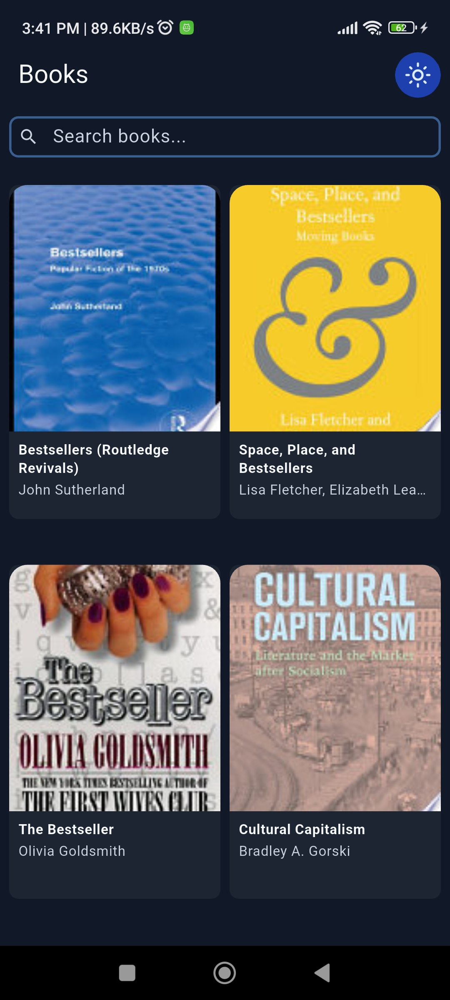
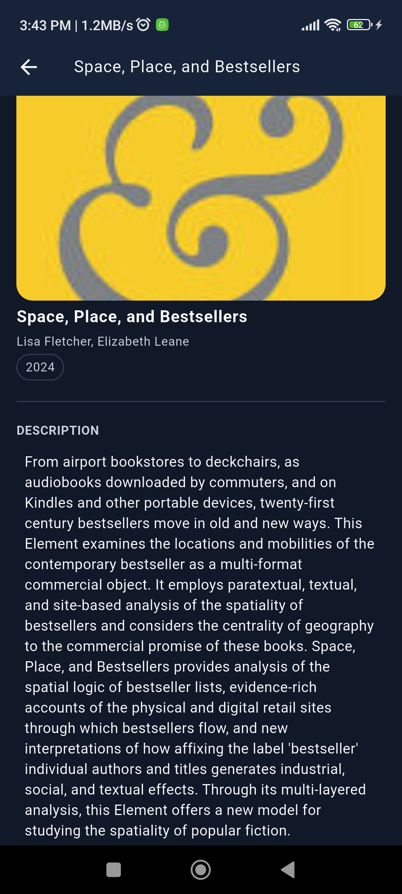

# 📚 Flutter Book Explorer

A Flutter application built with **Clean Architecture**, **Flutter Flavors**, and **BLoC state management**. It fetches books from the **Google Books API**, supports multi-language (English & Bengali) and dark/light theming, across three separate build environments.

---

## 📸 UI Showcase

| Book List | Book Details | Landing Screen |
|-----------|--------------|----------------|
|  |  |  |

---

## ✨ Features

- 📖 **Book Browsing** — Browse bestseller books fetched live from the Google Books API
- 🔍 **Debounced Search** — Real-time search with 300ms debounce, powered by `rxdart`
- 📄 **Infinite Scroll** — Load-more pagination with `droppable()` concurrency guard
- 🔄 **Pull-to-Refresh** — Refresh the current query results
- 📘 **Book Details** — Full book info fetched on-demand by ID
- 🌐 **Localization** — English (`en`) and Bengali (`bn`) supported via Flutter's ARB system
- 🌙 **Dark / Light Theme** — Toggleable at runtime, persisted via `SharedPreferences`
- 🏗️ **3 Flavors** — `dev`, `qa`, and `prod` environments with independent configurations

---

## 🗂️ Project Structure

```
lib/
├── core/
│   ├── app_context.dart         # Global app context singleton
│   ├── base/                    # Base BLoC, widgets, and mixins
│   ├── bloc/                    # GlobalBlocObserver & GlobalBlocProviders
│   ├── di/                      # GetIt dependency injection setup
│   ├── exceptions/              # Custom exception types
│   ├── network/                 # Dio client & interceptors
│   ├── routes/                  # go_router configuration
│   ├── services/                # CacheService (SharedPreferences)
│   ├── theme/                   # Light & dark ColorSchemes (Material 3)
│   ├── utils/                   # Transitions, helpers
│   ├── validators/              # Input validators
│   └── values/                  # App-wide constants (AppValues)
├── features/
│   ├── book/
│   │   ├── data/
│   │   │   ├── datasource/      # Remote data source (Dio + Google Books API)
│   │   │   ├── model/           # BookModel (JSON ↔ entity mapping)
│   │   │   └── repository/      # BookRepositoryImpl
│   │   ├── domain/
│   │   │   ├── entities/        # BookEntity
│   │   │   ├── repositories/    # Abstract BookRepository
│   │   │   └── use_cases/       # BookUseCase
│   │   └── presentation/
│   │       ├── book_list/
│   │       │   ├── bloc/        # BookBloc, BookEvent, BookState
│   │       │   ├── page/        # BookScreen (list UI)
│   │       │   └── widget/      # BooksGrid, ErrorView, BookCard
│   │       └── book_details/
│   │           ├── bloc/        # BookDetailsBloc, event, state
│   │           └── page/        # BookDetailsPage
│   ├── landing/
│   │   └── presentation/
│   │       └── pages/           # LandingScreen (language + theme toggle)
│   └── settings/                # Settings screen
├── flavors/
│   ├── environment.dart         # Environment enum (DEVELOPMENT, QA, PRODUCTION)
│   ├── env_config.dart          # EnvConfig (appName, baseUrl, apiKey, locale, themeMode)
│   ├── env_loader.dart          # EnvLoader — loads & parses .env keys by flavor prefix
│   └── build_config.dart        # Singleton BuildConfig — locks env on startup
├── l10n/
│   ├── app_en.arb               # English strings
│   └── app_bn.arb               # Bengali strings
├── gen_l10n/                    # Auto-generated localizations
├── main_dev.dart                # Dev entry point
├── main_qa.dart                 # QA entry point
├── main_prod.dart               # Prod entry point
└── my_app.dart                  # Root widget (MaterialApp.router)
```

---

## 🏗️ Flavor Setup

The app uses **Flutter Flavors** to support three distinct build environments. Each environment has its own entry point, app name, base URL, and API key.

### How It Works

```
.env file  ──▶  EnvLoader.load(prefix)  ──▶  EnvConfig  ──▶  BuildConfig.instance  ──▶  App
```

| File | Role |
|------|------|
| `flavors/environment.dart` | `enum Environment { DEVELOPMENT, QA, PRODUCTION }` |
| `flavors/env_loader.dart` | Loads `.env` via `flutter_dotenv`, parses keys by flavor prefix, asserts required values |
| `flavors/env_config.dart` | Holds `appName`, `baseUrl`, `googleBooksApiKey`, `locale`, `themeMode` |
| `flavors/build_config.dart` | Thread-safe singleton; locks after first `instantiate()` call |

Each entry point calls `EnvLoader.load(prefix)` which internally loads the `.env` file and validates the keys for that flavor:

```dart
// lib/flavors/env_loader.dart
class EnvLoader {
  static late final String baseUrl;
  static late final String googleBooksApiKey;

  static Future<void> load(String prefix) async {
    await dotenv.load(fileName: ".env");
    _parse(prefix, dotenv.env);
  }

  static void _parse(String prefix, Map<String, String> map) {
    final url    = map['${prefix}_BASE_URL'];
    final apiKey = map['${prefix}_GOOGLE_BOOKS_API_KEY'];

    assert(url != null && url.isNotEmpty,
        '${prefix}_BASE_URL is missing or empty in .env');
    assert(apiKey != null && apiKey.isNotEmpty,
        '${prefix}_GOOGLE_BOOKS_API_KEY is missing or empty in .env');

    baseUrl           = url!;
    googleBooksApiKey = apiKey!;
  }
}
```

```dart
// main_prod.dart
await EnvLoader.load("PROD");   // loads .env and validates PROD_* keys

BuildConfig.instantiate(
  envType: Environment.PRODUCTION,
  envConfig: EnvConfig(
    appName: "Production",
    baseUrl: EnvLoader.baseUrl,
    googleBooksApiKey: EnvLoader.googleBooksApiKey,
    themeMode: ...,
    locale: ...,
  ),
);
await di.init();
runApp(const MyApp());
```

> ⚠️ `assert()` only runs in **debug mode**. If a key is missing, the app crashes immediately with a clear message instead of silently using a wrong URL.

### Environment Table

| Environment | Entry Point | `EnvLoader` Prefix | `.env` Keys Used |
|-------------|-------------|-------------------|------------------|
| Development | `lib/main_dev.dart` | `"DEV"` | `DEV_BASE_URL`, `DEV_GOOGLE_BOOKS_API_KEY` |
| QA | `lib/main_qa.dart` | `"QA"` | `QA_BASE_URL`, `QA_GOOGLE_BOOKS_API_KEY` |
| Production | `lib/main_prod.dart` | `"PROD"` | `PROD_BASE_URL`, `PROD_GOOGLE_BOOKS_API_KEY` |

---

## 🧠 State Management — BLoC

This project uses **`flutter_bloc`** (BLoC pattern) as its state management solution.

### Why BLoC?

- Clear separation of UI and business logic
- Predictable, testable state transitions
- Works naturally with Clean Architecture's use-case layer
- Powerful concurrency control via `bloc_concurrency`

### BookBloc — Core State Machine

```
BookInitial
    │
    ▼ BookGetBooksEvent
BookLoading
    │
    ├─▶ BookLoaded(books, currentPage, hasReachedMax, currentQuery)
    │       │
    │       ├─▶ BookLoadMoreBooksEvent  ──▶  BookLoadingMore  ──▶  BookLoaded (appended)
    │       ├─▶ BookSearchBooksEvent   ──▶  BookLoading      ──▶  BookLoaded (new query)
    │       └─▶ BookRefreshBooksEvent  ──────────────────────▶  BookLoaded (reset page 0)
    │
    └─▶ BookError(message)
```

### Concurrency Strategy

| Event | Transformer | Behavior |
|-------|-------------|----------|
| `BookGetBooksEvent` | _(sequential)_ | Emits `BookLoading` then fetches |
| `BookSearchBooksEvent` | `debounce (300ms)` + `switchMap` | Cancels previous search on new input |
| `BookLoadMoreBooksEvent` | `droppable()` | Ignores new events while loading |
| `BookRefreshBooksEvent` | _(sequential)_ | Resets to page 0 |

### Dependency Injection

`GetIt` is used as the service locator. All BLoCs, use cases, repositories, and data sources are registered in `core/di/injection_container.dart` and injected via `GlobalBlocProviders`.

---

## 🚀 Setup Instructions

### Prerequisites

| Requirement | Minimum Version |
|-------------|----------------|
| Flutter SDK | `>=3.11.1` |
| Dart SDK | `^3.11.1` |
| IDE | Android Studio / VS Code with Flutter & Dart plugins |
| Platform | Android, iOS, Web, Linux, macOS, Windows |

### 1. Clone the Repository

```bash
git clone https://github.com/your-username/flutter_task_astha_it.git
cd flutter_task_astha_it
```

### 2. Install Dependencies

```bash
flutter pub get
```

### 3. Configure Environment Variables

Create a `.env` file in the **project root** (next to `pubspec.yaml`). A ready-to-use template is provided:

```bash
cp .env.example .env
```

Then open `.env` and fill in your real values:

```env
# Production
PROD_BASE_URL=https://www.googleapis.com/books/v1/
PROD_GOOGLE_BOOKS_API_KEY=your_production_api_key_here

# QA
QA_BASE_URL=https://qa.googleapis.com/books/v1/
QA_GOOGLE_BOOKS_API_KEY=your_qa_api_key_here

# Development
DEV_BASE_URL=https://dev.googleapis.com/books/v1/
DEV_GOOGLE_BOOKS_API_KEY=your_dev_api_key_here
```

Get your Google Books API key from the [Google Cloud Console](https://console.cloud.google.com/).

> ⚠️ **Never commit `.env` to Git.** It is already listed in `.gitignore`.
> The `.env.example` file (no real keys) is safe to commit and acts as the canonical key reference for the team.

### 4. Run the App

Use the `--flavor` flag with the matching target entry point:

```bash
# Development
flutter run --flavor dev -t lib/main_dev.dart

# QA
flutter run --flavor qa -t lib/main_qa.dart

# Production
flutter run --flavor prod -t lib/main_prod.dart
```

### 5. Build APK / IPA

#### Android

```bash
flutter build apk --flavor dev   -t lib/main_dev.dart
flutter build apk --flavor qa    -t lib/main_qa.dart
flutter build apk --flavor prod  -t lib/main_prod.dart
```

#### iOS

```bash
flutter build ios --flavor dev   -t lib/main_dev.dart
flutter build ios --flavor qa    -t lib/main_qa.dart
flutter build ios --flavor prod  -t lib/main_prod.dart
```

### VS Code Launch Configurations (optional)

Add to `.vscode/launch.json` for one-click launches:

```json
{
  "version": "0.2.0",
  "configurations": [
    {
      "name": "Dev",
      "request": "launch",
      "type": "dart",
      "args": ["--flavor", "dev", "-t", "lib/main_dev.dart"]
    },
    {
      "name": "QA",
      "request": "launch",
      "type": "dart",
      "args": ["--flavor", "qa", "-t", "lib/main_qa.dart"]
    },
    {
      "name": "Prod",
      "request": "launch",
      "type": "dart",
      "args": ["--flavor", "prod", "-t", "lib/main_prod.dart"]
    }
  ]
}
```

---

## 📦 Key Dependencies

| Package | Version | Purpose |
|---------|---------|---------|
| `flutter_bloc` | `^9.1.0` | BLoC state management |
| `bloc_concurrency` | `^0.3.0` | `droppable()` / `restartable()` transformers |
| `rxdart` | `^0.27.7` | `debounceTime` / `switchMap` for search |
| `get_it` | `7.6.0` | Service locator / DI |
| `dartz` | `0.10.1` | Functional `Either` type for use cases |
| `dio` | `4.0.6` | HTTP client |
| `pretty_dio_logger` | `1.2.0-beta-1` | Request/response logging |
| `go_router` | `^10.0.0` | Declarative routing |
| `shared_preferences` | `2.2.0` | Persisting theme & language |
| `flutter_screenutil` | `5.8.4` | Responsive sizing |
| `cached_network_image` | `^3.3.1` | Efficient image loading & caching |
| `flutter_svg` | `2.0.7` | SVG asset rendering |
| `equatable` | `^2.0.7` | Value equality for BLoC states |
| `flutter_dotenv` | `^5.2.1` | Load environment variables from `.env` |

---

## 🌐 Localization

The app supports **English** and **Bengali** using Flutter's built-in ARB-based localization system.

- ARB files are in `lib/l10n/` (`app_en.arb`, `app_bn.arb`)
- Generated code lives in `lib/gen_l10n/`
- Language preference is persisted via `CacheService` and applied through `BaseBloc`

To add a new string:
1. Add the key/value to both `app_en.arb` and `app_bn.arb`
2. Run `flutter gen-l10n` (or `flutter pub get` with `generate: true`)

---

## 📄 License

This project was created as part of a Flutter technical assessment for **Astha IT**.
